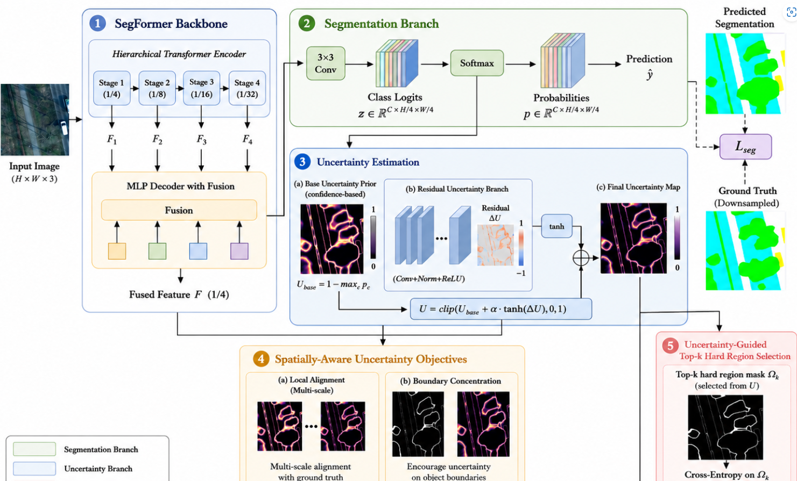
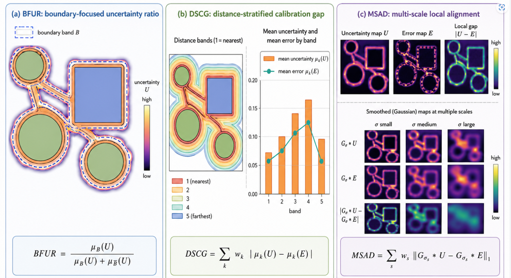

# SUF-HRL

Official implementation of **Spatially-Aware Uncertainty Feedback for Hard-Region Learning in Remote Sensing Semantic Segmentation**.

SUF-HRL turns prediction uncertainty from a post-hoc reliability indicator into a **spatial feedback signal** for hard-region learning. Instead of selecting isolated pixels only by loss or raw confidence, SUF-HRL learns a spatially structured uncertainty map and uses it to guide additional supervision around boundary-adjacent and error-prone regions.

## Overview

<p align="center">
  
</p>

<p align="center">
  <b>Fig. 1.</b> Overview of SUF-HRL. A SegFormer-B2 backbone produces fused decoder features and segmentation probabilities. An MSP-based uncertainty prior is refined by a residual uncertainty branch. The learned uncertainty map is regularized by spatial uncertainty objectives and then used to select top-k hard regions for additional supervision.
</p>

The core pipeline contains five components:

1. **SegFormer-B2 segmentation baseline** for remote sensing semantic segmentation.
2. **MSP uncertainty prior** from the predicted probability distribution.
3. **Residual uncertainty refinement** using decoder features to produce a learned spatial uncertainty map.
4. **Spatial uncertainty objectives** that encourage local error alignment and boundary concentration.
5. **Uncertainty-guided top-k hard-region supervision** for boundary-adjacent, small-object, and transition regions.

## Spatial uncertainty indicators

<p align="center">
  
</p>

<p align="center">
  <b>Fig. 2.</b> Illustration of the spatial uncertainty indicators used to evaluate whether uncertainty is not only high on wrong pixels, but also spatially organized around remote-sensing hard regions.
</p>

We use three spatial uncertainty indicators in addition to conventional error-detection and calibration metrics:

- **BFUR (Boundary-Focused Uncertainty Ratio)** measures how much uncertainty is concentrated inside the ground-truth boundary band compared with non-boundary regions. A higher value indicates that uncertainty is more boundary-aware.
- **DSCG (Distance-Stratified Calibration Gap)** compares the mean uncertainty and mean error across distance bands from object boundaries. A lower value means that uncertainty better follows boundary-distance-dependent prediction difficulty.
- **MSAD (Multi-Scale Local Alignment Distance)** compares Gaussian-smoothed uncertainty and error maps at multiple spatial scales. A lower value indicates better local alignment between uncertainty and actual error regions.

These indicators are especially useful for high-resolution remote sensing scenes, where errors often appear around dense urban boundaries, thin roads, tree crowns, small vehicles, shadows, and land-cover transitions.

## Repository structure

```text
SUF-HRL/
├── configs/                  # Dataset configs and MMSegmentation baseline configs
├── sufh_rl/                  # Core package
│   ├── models/               # SegFormer baseline and SUF-HRL model
│   ├── losses/               # Dice, focal, top-k, local, and boundary losses
│   ├── datasets/             # Potsdam, Vaihingen, and LoveDA dataloaders
│   ├── metrics/              # mIoU, boundary mIoU, BFUR, DSCG, MSAD
│   └── utils/                # Config and reproducibility helpers
├── tools/                    # Training, evaluation, and visualization entry points
├── scripts/                  # Example shell commands
└── docs/                     # Dataset preparation and figure notes
```

## Installation

```bash
conda create -n sufhrl python=3.10 -y
conda activate sufhrl
pip install -r requirements.txt
```

This code uses HuggingFace SegFormer. The paper experiments use `nvidia/mit-b2`.

## Dataset preparation

The code expects each dataset to be converted into the following layout:

```text
/path/to/dataset/
├── processed_multiclass/
│   ├── images/
│   │   ├── sample_0001.png
│   │   └── ...
│   └── labels/
│       ├── sample_0001.png
│       └── ...
└── splits/
    ├── train.txt
    ├── val.txt
    └── test.txt
```

Each split file contains one sample id per line, without file extension.

More details are provided in [`docs/dataset_preparation.md`](docs/dataset_preparation.md).

## Training

Edit the dataset root in a config file, for example `configs/potsdam.yaml`, and run:

```bash
python tools/train.py --config configs/potsdam.yaml --method suf_hrl
```

Other supported method flags include:

```text
baseline, focal, ohem, loss_topk, msp_topk, entropy_topk, suf_hrl
```

Example scripts are provided in `scripts/`:

```bash
bash scripts/train_potsdam.sh
bash scripts/train_vaihingen.sh
bash scripts/train_loveda.sh
```

## Evaluation

Global segmentation metrics:

```bash
python tools/evaluate.py \
  --config configs/potsdam.yaml \
  --checkpoint outputs/potsdam_suf_hrl/checkpoints/best.pth
```

Boundary mIoU:

```bash
python tools/eval_boundary_miou.py \
  --config configs/potsdam.yaml \
  --checkpoint outputs/potsdam_suf_hrl/checkpoints/best.pth \
  --widths 3 5 7
```

Uncertainty quality:

```bash
python tools/eval_uncertainty_quality.py \
  --config configs/vaihingen.yaml \
  --checkpoint outputs/vaihingen_suf_hrl/checkpoints/best.pth \
  --source learned
```

Qualitative visualization:

```bash
python tools/make_qualitative_figures.py \
  --config configs/potsdam.yaml \
  --checkpoint outputs/potsdam_suf_hrl/checkpoints/best.pth \
  --out-dir docs/figures/potsdam_examples
```

## Paper figures and examples

Manuscript figures and selected qualitative visualizations can be placed in `docs/figures/`. Raw datasets, large checkpoints, temporary logs, and full experiment outputs should not be committed to this repository.

## Notes

This public version is a cleaned research-code release. It keeps the main SUF-HRL implementation, training logic, evaluation metrics, and dataset interfaces.


