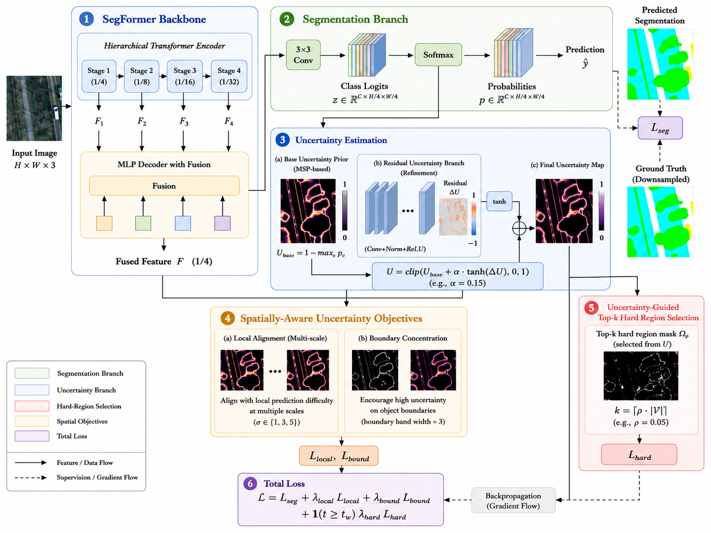
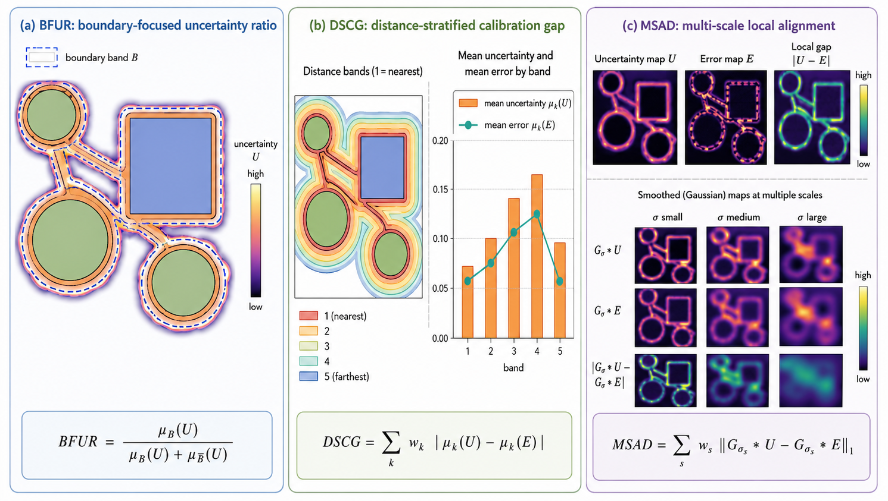

# SUF-HRL

Official implementation of **Spatially-Aware Uncertainty Feedback for Hard-Region Learning in Remote Sensing Semantic Segmentation**.

SUF-HRL turns prediction uncertainty from a post-hoc reliability indicator into a **spatial feedback signal** for hard-region learning. Instead of selecting isolated pixels only by loss or raw confidence, SUF-HRL learns a spatially structured uncertainty map and uses it to guide additional supervision around boundary-adjacent and error-prone regions.

## Overview

<p align="center">
  
</p>

<p align="center">
  <b>Fig. 1.</b> Overview of SUF-HRL. A SegFormer-B2 backbone produces fused decoder features and segmentation probabilities. An MSP-based uncertainty prior is refined by a residual uncertainty branch. The learned uncertainty map is regularized by spatial uncertainty objectives and then used to select top-k hard regions for additional supervision.
</p>

SUF-HRL is designed for high-resolution remote sensing semantic segmentation, where errors are often concentrated in structured hard regions, such as:

- **Object boundaries** — edges between adjacent land-cover classes
- **Small objects** — vehicles, individual tree crowns, and thin linear structures
- **Shadow regions** — areas with ambiguous illumination and texture
- **Ambiguous land-cover transitions** — gradients between spectrally similar classes

The core pipeline contains five components:

1. **SegFormer-B2 segmentation baseline** for remote sensing semantic segmentation.
2. **MSP uncertainty prior** from the predicted probability distribution.
3. **Residual uncertainty refinement** using decoder features to produce a learned spatial uncertainty map.
4. **Spatial uncertainty objectives** that encourage local error alignment and boundary concentration.
5. **Uncertainty-guided top-k hard-region supervision** for boundary-adjacent, small-object, and transition regions.

The learned uncertainty is not only used as a reliability indicator, but also serves as a feedback signal for improving difficult regions.

## Spatial uncertainty indicators

<p align="center">
  
</p>

<p align="center">
  <b>Fig. 2.</b> Illustration of the spatial uncertainty indicators used to evaluate whether uncertainty is not only high on wrong pixels, but also spatially organized around remote-sensing hard regions.
</p>

SUF-HRL evaluates uncertainty quality using both conventional error-detection and calibration metrics, plus three spatially-aware indicators:

- **BFUR (Boundary-Focused Uncertainty Ratio)** measures how much uncertainty is concentrated inside the ground-truth boundary band compared with non-boundary regions. A higher value indicates that uncertainty is more boundary-aware.
- **DSCG (Distance-Stratified Calibration Gap)** compares the mean uncertainty and mean error across distance bands from object boundaries. A lower value means that uncertainty better follows boundary-distance-dependent prediction difficulty.
- **MSAD (Multi-Scale Local Alignment Distance)** compares Gaussian-smoothed uncertainty and error maps at multiple spatial scales. A lower value indicates better local alignment between uncertainty and actual error regions.

These indicators are especially useful for high-resolution remote sensing scenes, where errors often appear around dense urban boundaries, thin roads, tree crowns, small vehicles, shadows, and land-cover transitions.

## Repository structure

```text
SUF-HRL/
├── configs/                  # Dataset configs and MMSegmentation baseline configs
├── sufh_rl/                  # Core package
│   ├── models/               # SegFormer baseline and SUF-HRL model
│   ├── losses/               # Dice, focal, top-k, local, and boundary losses
│   ├── datasets/             # Potsdam, Vaihingen, and LoveDA dataloaders
│   ├── metrics/              # mIoU, boundary mIoU, BFUR, DSCG, MSAD
│   └── utils/                # Config and reproducibility helpers
├── tools/                    # Training, evaluation, and visualization entry points
├── scripts/                  # Example shell commands
├── docs/                     # Dataset preparation and figure notes
└── tests/                    # Repository verification tests
```

## Installation

```bash
conda create -n sufhrl python=3.10 -y
conda activate sufhrl
pip install -r requirements.txt
```

This code uses HuggingFace SegFormer. The paper experiments use `nvidia/mit-b2`.

## Dataset preparation

The code expects each dataset to be converted into the following layout:

```text
/path/to/dataset/
├── processed_multiclass/
│   ├── images/
│   │   ├── sample_0001.png
│   │   └── ...
│   └── labels/
│       ├── sample_0001.png
│       └── ...
└── splits/
    ├── train.txt
    ├── val.txt
    └── test.txt
```

Each split file contains one sample id per line, without file extension.

More details are provided in [`docs/dataset_preparation.md`](docs/dataset_preparation.md).

## Training

Edit the dataset root in a config file, for example `configs/potsdam.yaml`, and run:

```bash
python tools/train.py --config configs/potsdam.yaml --method suf_hrl
```

Example scripts are provided in `scripts/`:

```bash
bash scripts/train_potsdam.sh
bash scripts/train_vaihingen.sh
bash scripts/train_loveda.sh
```

## Evaluation

After downloading the checkpoints, run the evaluation for each dataset.

### Potsdam

```bash
PYTHONPATH=. \
TRANSFORMERS_OFFLINE=1 \
HF_HUB_OFFLINE=1 \
python tools/eval_potsdam.py \
  --checkpoint checkpoints/potsdam_sufhrl_b2.pth
```

### Vaihingen

```bash
PYTHONPATH=. \
TRANSFORMERS_OFFLINE=1 \
HF_HUB_OFFLINE=1 \
python tools/eval_vaihingen.py \
  --checkpoint checkpoints/vaihingen_sufhrl_b2.pth
```

### LoveDA

```bash
PYTHONPATH=. \
TRANSFORMERS_OFFLINE=1 \
HF_HUB_OFFLINE=1 \
python tools/eval_loveda.py \
  --checkpoint checkpoints/loveda_sufhrl_b2.pth
```

## Table III spatial uncertainty evaluation

Table III evaluates uncertainty quality with the following metrics:

- Error AUROC
- Error AUPR
- UCE
- BFUR
- DSCG
- MSAD

Run:

```bash
python tools/tableIII/tableIII_spatial_uncertainty_eval.py
```

Required checkpoints (place them in `checkpoints/tableIII/`):

```text
checkpoints/tableIII/
├── vaihingen_baseline_seed0_tableIII.pth
└── vaihingen_sufhrl_seed0_tableIII.pth
```

## Qualitative visualization

Generate qualitative comparison figures:

```bash
PYTHONPATH=. \
python tools/make_qualitative_comparison.py \
  --dataset potsdam \
  --checkpoint checkpoints/potsdam_sufhrl_b2.pth \
  --split test \
  --num-cases 4 \
  --output-dir results/qualitative
```

## Pretrained checkpoints

Large model weights are provided separately and are not included in this repository. Download them from the links below and place them under `checkpoints/`.

### Main B2 models

| Model | Checkpoint file | Download |
| --- | --- | --- |
| Potsdam SUF-HRL | `potsdam_sufhrl_b2.pth` | [Google Drive](https://drive.google.com/file/d/1IQNtyWzrsQlyIDxjzWaiQoVOJadTmYu4/view?usp=sharing) |
| Vaihingen SUF-HRL | `vaihingen_sufhrl_b2.pth` | [Google Drive](https://drive.google.com/file/d/1BmAAdMgrVWqSJolKQihqSzPWB-mcWJ-3/view?usp=sharing) |
| LoveDA SUF-HRL | `loveda_sufhrl_b2.pth` | [Google Drive](https://drive.google.com/file/d/1E9Zx6odxZJxDSRShBBag0tLIGD4DRQAQ/view?usp=sharing) |

### Table III models

| Model | Checkpoint file | Download |
| --- | --- | --- |
| Vaihingen baseline | `vaihingen_baseline_seed0_tableIII.pth` | [Google Drive](https://drive.google.com/file/d/1hv-jqp8ylnA0gv6hvYDI3lXC3wltFy4D/view?usp=sharing) |
| Vaihingen SUF-HRL | `vaihingen_sufhrl_seed0_tableIII.pth` | [Google Drive](https://drive.google.com/file/d/1h5J2SuFCONp9r6SfSkSq97NaNFEwfVvp/view?usp=sharing) |

### MIT-B5 generalization models

| Model | Checkpoint file | Download |
| --- | --- | --- |
| Potsdam MIT-B5 SUF-HRL | `potsdam_mitb5_sufhrl_b5.pth` | [Google Drive](https://drive.google.com/file/d/11tad9FHeJQ0Fp6z2R0kPbVQuPwxvTzb1/view?usp=sharing) |
| Vaihingen MIT-B5 SUF-HRL | `vaihingen_mitb5_sufhrl_b5.pth` | [Google Drive](https://drive.google.com/file/d/1kmNyZtFhqO7q3rxzAtLtkRDwbs5CtUy1/view?usp=sharing) |
| LoveDA MIT-B5 SUF-HRL | `loveda_mitb5_sufhrl_b5.pth` | [Google Drive](https://drive.google.com/file/d/1weYyvhv4ItAXAgmDieTa2JBqBu-JedvY/view?usp=sharing) |

## Notes

This public version is a cleaned research-code release. It keeps:

- SUF-HRL model implementation
- Training pipeline
- Evaluation scripts
- Uncertainty metrics
- Dataset interfaces
- Visualization tools

Large datasets, checkpoints, logs, and temporary experiment outputs are distributed separately.
